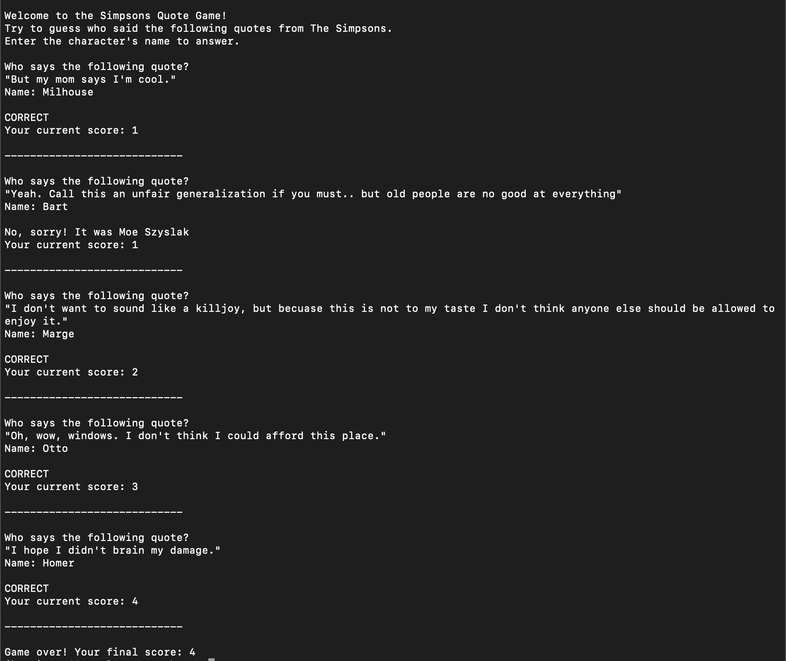

# Simpsons Guessing Game

Welcome to the Simpsons Quote Game! Test your knowledge of The Simpsons characters by guessing who said the provided quotes.



## How to Play

1. Clone the repository to your local machine.
   ```bash
   git clone https://github.com/samjsolomon/simpsons-guessing-game.git
   ```

2. Navigate to the project directory.
   ```bash
   cd simpsons-guessing-game
   ```

3. Run the Python script.
   ```bash
   python main.py
   ```

4. Follow the on-screen instructions to guess the character who said the displayed quote. Enter the character's name. First and last, or just first will work.

5. After each round, your current score will be displayed.

6. The game consists of a fixed number of rounds (default: 5). After the final round, your total score will be shown.

## Requirements

- Python 3.x
- requests library (install using `pip install requests`)

## Acknowledgments

- The Simpsons Quote API: [https://thesimpsonsquoteapi.glitch.me](https://thesimpsonsquoteapi.glitch.me)


